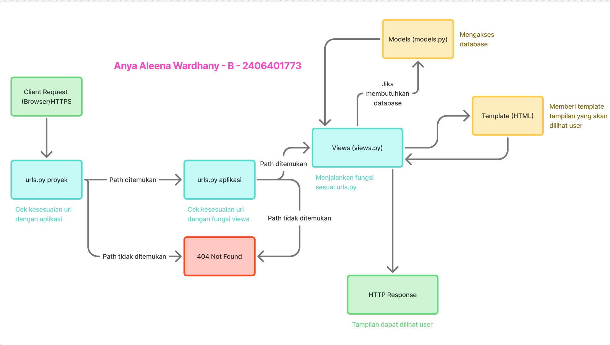

Anya Aleena Wardhany - B - 2406401773

Latihan 2

- Jelaskan bagaimana cara kamu mengimplementasikan checklist di atas secara step-by-step (bukan hanya sekadar mengikuti tutorial).

1. Membuat proyek Django: install dependencies -> start proyek dengan perintah "startproject" -> setting environment variables -> jalankan server
2. Membuat aplikasi: buat aplikasi dengan perintah "startapp" 
3. Routing proyek dengan aplikasi: memasukkan 'main' sebagai installed apps di settings.py
4. Membuat model bernama 'Product': pada models.py buat class bernama 'Product' yang berisi atribut wajib
5. Membuat fungsi pada Views: pada views.py, buat fungsi berisi variables beserta value-nya yang nantinya akan digunakan pada HTML template
6. Routing urls.py pada aplikasi: pada urls.py di directory main, inisiasikan url pattern dengan menulis nama fungsi yang tadi dibuat di views.py
7. Deployment ke PWS: pakai command git push pws master pada main directory

- Buatlah bagan yang berisi request client ke web aplikasi berbasis Django beserta responnya dan jelaskan pada bagan tersebut kaitan antara urls.py, views.py, models.py, dan berkas html.

- Jelaskan peran settings.py dalam proyek Django!

Seperti "settings" pada umumnya, settings.py adalah pusat pengaturan dari proyek Django. Di sana disimpan konfigurasi seperti INSTALLED_APPS; database seperti nama user, password, dll; set environment seperti DEBUG = True; static files untuk CSS, JS, Images. Pada dasarnya file ini menjadi acuan utama yang menentukan bagaimana sebuah proyek Django dijalankan.

- Bagaimana cara kerja migrasi database di Django?

Konsep migrasi database pada Django sebenarnya mirip dengan git add commit push ke Github. Hal-hal yang di-update pada models.py harus dimigrasi agar database proyek mengikuti informasi terbaru dari kode.

- Menurut Anda, dari semua framework yang ada, mengapa framework Django dijadikan permulaan pembelajaran pengembangan perangkat lunak?

Alasan utama framework Django dijadikan permulaan yang sudah jelas di mata saya adalah penggunaan bahasa Python yang memang cukup mudah dipahami. Selain itu, framework Django juga sudah sangat lengkap sehingga kita bisa lebih fokus di bagian MVT.

- Apakah ada feedback untuk asisten dosen tutorial 1 yang telah kamu kerjakan sebelumnya?

Sudah baik. Asdos komunikatif dan dokumen tutorial jelas.